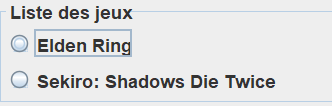
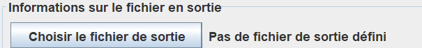
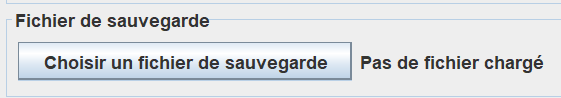

# SekiroDeathCounter

## Installation

Télécharger et installer la jdk java 21 : https://www.oracle.com/fr/java/technologies/downloads/#jdk21-windows
Lancer le fichier SekiroDeathCounter[Version].jar

## Utilisation

Sélectionner le jeu.

Sélectionner le fichier dans lequel sera sauvegardé le nombre de mort.

Choisir le fichier de sauvegarde .sl2 associé.

> [!TIP]
> Les fichiers de sauvegarde des jeux FromSoftware se trouvent généralement dans le répertoire
**C:\Users\\_NomUtilisateur_\AppData\Roaming**

## Evolutions
- [x] Automatisation du compteur de mort
- [ ] Afficher les informations du personnage (nom, level, temps de jeu,...) dans la section "Informations sur la sauvegarde"
- [ ] Permettre à l'utilisateur de choisir un slot de sauvegarde
- [ ] Implémenter solution pour Dark Souls 1, Dark Souls 2 et Dark Souls 3